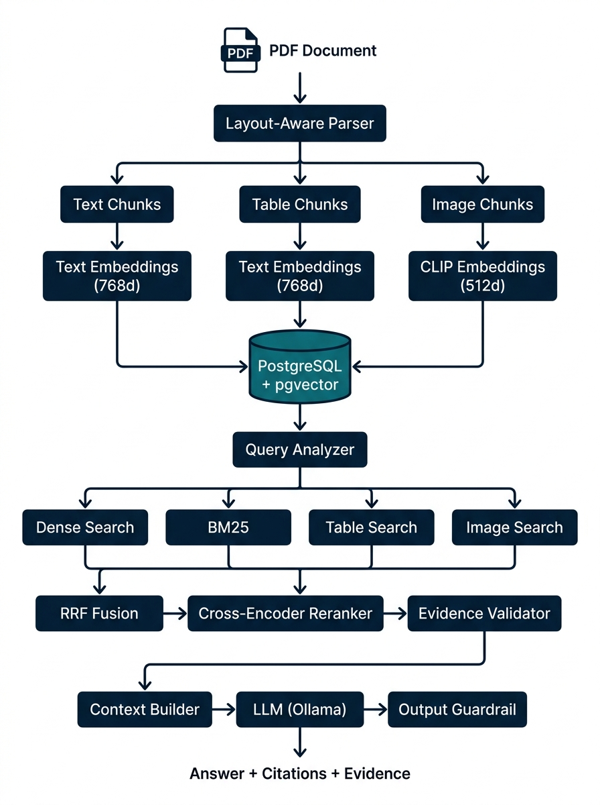
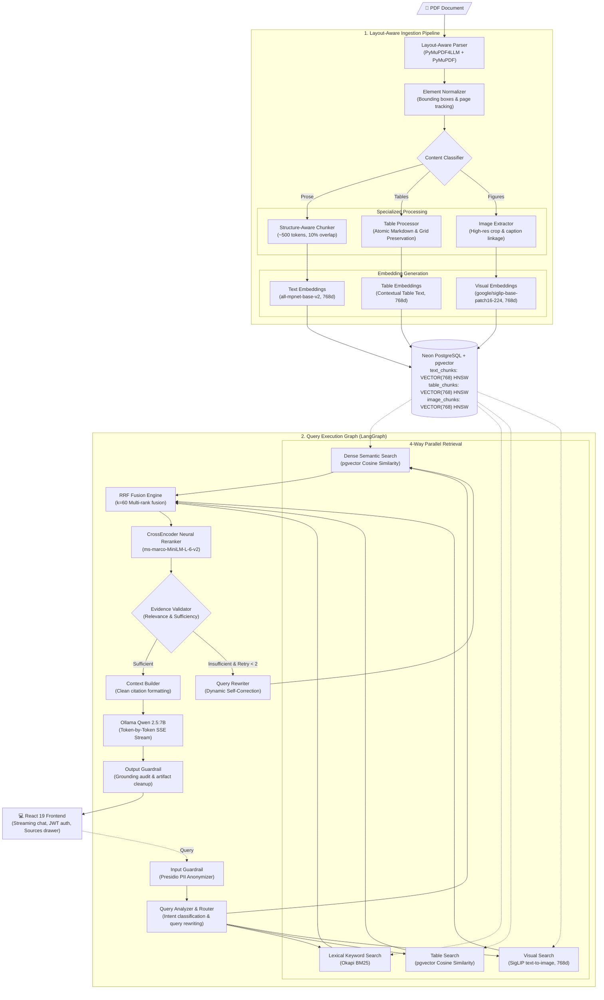

# Multimodal RAG — Evidence-Grounded Research Paper Intelligence

[](https://python.org)
[](https://fastapi.tiangolo.com)
[](https://react.dev)
[](https://vitejs.dev)
[](https://github.com/pgvector/pgvector)
[](https://langchain.com/langgraph)
[](https://huggingface.co/google/siglip-base-patch16-224)
[](https://ollama.com)

A production-grade, multimodal Retrieval-Augmented Generation (RAG) platform designed to ingest complex academic research papers and technical documents. It bridges dense prose, atomic tables, and visual figures/charts using unified 768-dimensional vector representations, Reciprocal Rank Fusion (RRF), neural CrossEncoder reranking, and self-correcting LangGraph workflows.

---

## 📌 The Problem & Motivation

Scientific papers and technical specifications are inherently multimodal:
- **Dense Prose**: Complex methodologies, theorems, and academic discourse.
- **Structured Tables**: High-density numerical data, benchmark scores, and hyperparameters.
- **Diagrams & Charts**: Architectural schematics, workflows, PR curves, and visual trends.

### Why Traditional Text-Only RAG Fails:
| Failure Mode | Impact on Scientific Queries | Multimodal RAG Solution |
| :--- | :--- | :--- |
| **Tables Flattened to Text** | Column relationships collapse; exact numbers are lost | **Atomic Table Extraction** + structured markdown embeddings |
| **Figures & Charts Ignored** | Visual architecture & PR curves are blind to the LLM | **Google SigLIP (768d)** text-to-image semantic retrieval |
| **Hallucinated Citations** | Missing page boundaries lead to unverified claims | **Deterministic Grounding** with clean `[Page X, Section Y]` attribution |
| **Scoring Discrepancies** | Cosine similarity cannot compare with keyword scores | **Reciprocal Rank Fusion (RRF)** combines diverse retrieval branches |

---

## 🏗️ Visualization Workflow

The end-to-end architecture is divided into an asynchronous **Multimodal Ingestion Pipeline** and a resilient, self-correcting **Query Execution Graph**.

### Architecture Diagram





---

## ⚡ Core Technical Innovations

### 1. Unified 768-Dimensional Vector Representation
- **Academic Prose & Tables**: Embedded using `sentence-transformers/all-mpnet-base-v2` (768 dimensions).
- **Diagrams, Charts & Figures**: Embedded using `google/siglip-base-patch16-224` (768 dimensions).
- **Unified Column Types**: All PostgreSQL pgvector columns (`text_chunks`, `table_chunks`, `image_chunks`) use uniform `VECTOR(768)` with dedicated HNSW cosine distance indexes (`m=16`, `ef_construction=64`).

### 2. Modality Separation & Reciprocal Rank Fusion (RRF)
Raw cosine scores from text embeddings and visual embeddings exist in completely different vector spaces and are **never directly compared**. Instead, candidate rankings are fused using Reciprocal Rank Fusion:
$$RRF(d) = \sum_{m \in M} \frac{1}{k + \text{rank}_m(d)} \quad (k=60)$$

### 3. Neural CrossEncoder Reranking
Top candidates from RRF fusion are reranked using `cross-encoder/ms-marco-MiniLM-L-6-v2` for cross-attention scoring. The reranker centers on relevant table and figure captions to avoid character truncation issues.

### 4. Dynamic Self-Correction Loop (LangGraph StateGraph)
If the **Evidence Validator** determines the retrieved evidence is insufficient:
1. It triggers the **Query Rewriter**.
2. The query is re-formulated with expanded synonyms and technical aliases.
3. Secondary retrieval executes automatically before prompting the LLM.

### 5. Double Guardrails
- **Input Guardrail**: Scans queries for PII using Microsoft Presidio and performs input sanitization.
- **Output Guardrail**: Audits grounding ratios between generated answers and retrieved passages, removes OCR/spacing artifacts, strips duplicate summaries, and anonymizes sensitive data.

### 6. Modern React 19 Single Page Application
- **Zero-Dependency Styling**: Bespoke Vanilla CSS design system (dark slate theme, glassmorphism, Outfit & Inter typography).
- **Real-Time Token Streaming**: Server-Sent Events (SSE) stream tokens directly from Ollama to the browser with animated cursor indicators (`▍`).
- **On-Demand Sources Drawer**: Sources remain cleanly tucked away under a `📚 Sources` button, expandable into verified citations, evidence snippets, retrieval traces, and high-res image lightboxes.
- **JWT Session Management**: Signed PyJWT tokens with real-time expiration validation.
- **Document Management**: Load, upload, and permanently delete/unload documents with cascading chunk deletions.

---

## 📊 Database Schema

Stored in **Neon PostgreSQL** with `pgvector`:

```sql
-- Documents Registry
CREATE TABLE documents (
    id UUID PRIMARY KEY,
    filename VARCHAR(500) NOT NULL,
    file_path VARCHAR(1000) NOT NULL,
    file_hash VARCHAR(64),
    page_count INT DEFAULT 0,
    status VARCHAR(20) DEFAULT 'PENDING',
    created_at TIMESTAMPTZ DEFAULT NOW(),
    metadata JSONB DEFAULT '{}'
);

-- Text Chunks (768d MPNet)
CREATE TABLE text_chunks (
    id UUID PRIMARY KEY,
    document_id UUID REFERENCES documents(id) ON DELETE CASCADE,
    page_number INT,
    section TEXT,
    content TEXT,
    embedding VECTOR(768),
    created_at TIMESTAMPTZ DEFAULT NOW()
);
CREATE INDEX ix_text_chunks_embedding ON text_chunks USING hnsw (embedding vector_cosine_ops);

-- Table Chunks (768d Atomic Markdown)
CREATE TABLE table_chunks (
    id UUID PRIMARY KEY,
    document_id UUID REFERENCES documents(id) ON DELETE CASCADE,
    page_number INT,
    section TEXT,
    table_content TEXT,
    table_data JSONB,
    embedding VECTOR(768),
    created_at TIMESTAMPTZ DEFAULT NOW()
);
CREATE INDEX ix_table_chunks_embedding ON table_chunks USING hnsw (embedding vector_cosine_ops);

-- Image & Figure Chunks (768d Google SigLIP)
CREATE TABLE image_chunks (
    id UUID PRIMARY KEY,
    document_id UUID REFERENCES documents(id) ON DELETE CASCADE,
    page_number INT,
    section TEXT,
    caption TEXT,
    image_path VARCHAR(1000),
    image_embedding VECTOR(768),
    created_at TIMESTAMPTZ DEFAULT NOW()
);
CREATE INDEX ix_image_chunks_embedding ON image_chunks USING hnsw (image_embedding vector_cosine_ops);

-- Chat Histories
CREATE TABLE chat_histories (
    id UUID PRIMARY KEY,
    user_id UUID,
    document_id UUID,
    query TEXT,
    answer TEXT,
    citations JSONB DEFAULT '[]',
    evidence JSONB DEFAULT '[]',
    created_at TIMESTAMPTZ DEFAULT NOW()
);
```

---

## 🚀 API Reference

### 1. Streaming Chat (`POST /api/chat/stream`)
Real-time Server-Sent Events (SSE) token delivery:
```bash
curl -N -X POST http://localhost:8000/api/chat/stream \
  -H "Content-Type: application/json" \
  -d '{"document_id": "<UUID>", "query": "What are the main results in Table 2?"}'
```
**Events Emitted**:
- `data: {"type": "metadata", "citations": [...], "evidence": [...], "retrieval_trace": {...}}`
- `data: {"type": "token", "token": "The"}`
- `data: {"type": "token", "token": " evaluation"}`
- `data: {"type": "done", "final_answer": "...", "citations": [...]}`

### 2. Document Management
- `POST /api/documents/upload`: Upload PDF and trigger asynchronous layout extraction.
- `GET /api/documents/{id}`: Inspect page counts, text chunks, table chunks, and images.
- `DELETE /api/documents/{id}`: Cascading deletion of document records and vector chunks.

### 3. Authentication
- `POST /api/auth/signup`: Register user and issue signed HS256 JWT.
- `POST /api/auth/signin`: Authenticate user and issue signed JWT with expiration timestamp.
- `GET /api/auth/me`: Validate active Bearer token.

---

## 🧪 Testing & Verification

Comprehensive automated test suite verifying every component:
```bash
python -m pytest tests/ -v
```

```text
============================= test session starts =============================
collected 37 items

tests/test_auth_history.py ....                                          [ 10%]
tests/test_chat.py ...                                                   [ 18%]
tests/test_chunking.py .....                                             [ 32%]
tests/test_graph.py ........                                             [ 54%]
tests/test_ingestion.py .....                                            [ 67%]
tests/test_retrieval.py .......                                          [ 86%]
tests/test_rrf.py .....                                                  [100%]

============================= 37 passed in 8.74s ==============================
```

---

## 🛠️ Quickstart Guide

### Prerequisites
- Python 3.11+ (Python 3.13 tested)
- Node.js 18+
- Ollama with `qwen2.5:7b` model (`ollama pull qwen2.5:7b`)
- PostgreSQL with `pgvector` extension (or cloud Neon PostgreSQL)

### 1. Backend Setup
```bash
# Clone repository
git clone https://github.com/Sathvik33/Enverus.git
cd Enverus

# Install Python dependencies
pip install -r requirements.txt

# Configure environment variables
cp .env.example .env
# Edit .env with your DATABASE_URL and OLLAMA_BASE_URL

# Start backend server
uvicorn app.main:app --reload --port 8000
```

### 2. Frontend Setup
```bash
cd frontend

# Install Node dependencies
npm install

# Start Vite development server
npm run dev
```
Open **`http://localhost:5173`** in your browser to launch the application.